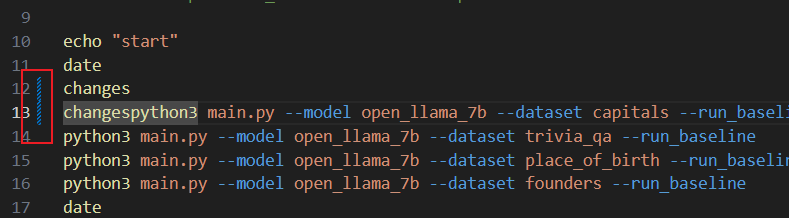
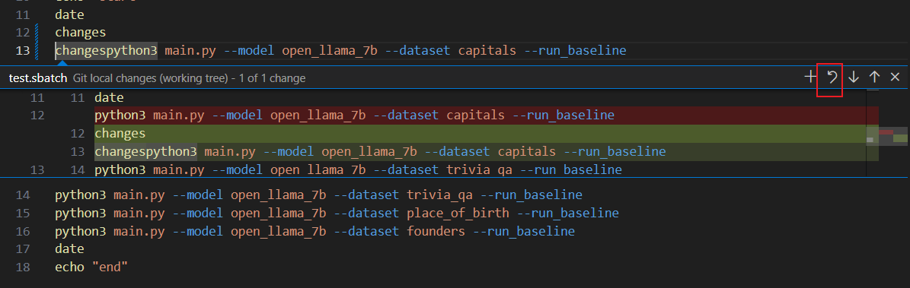
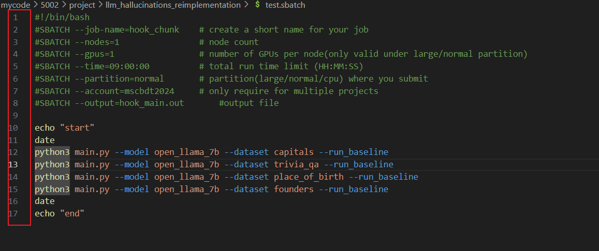

# llm_hallucinations_reimplementation

This is based on the paper "On Early Detection of Hallucinations in Factual Question Answering". All rights are reserved by the authors of the paper.

# How to use
To download the repo, run: `git clone https://github.com/johnnyzheng0636/llm_hallucinations_reimplementation.git`

Move into the repo: `cd llm_hallucinations_reimplementation`

Initialize Conda on Superpod run: `conda`

If not exist, follow the instruction, else process

To set up environment, run: `source setup.sh`

Before runing any python code, please easure the correct virtual environment (venv) is activate, i.e.

```
(hallucination) user_name@host_name:$
```

If the starting `(hallucination)` is missing, run `conda activate hallucination` to activate the correct venv. If success, you will see the starting `(hallucination)`

To collect data and train the hallucination classifier, run: `python main.py`. To run with GPU on SuperPod run `sbatch test.sbatch`

To plot graph, run: `python graph_cpu.py`

Notice that the parameter of graph_cpu.py and main.py should be identical for the same dataset and model

e.g

```
python main.py --model open_llama_7b --dataset capitals
python graph_cpu.py --model open_llama_7b --dataset capitals
```

To run a demo of halluccination classifier. run: `python demo.py` with the same parameters as `python main.py`

To rerun a model for updated code add flag `--train_exist`. This flag will bypass on skip on exist data/files/classifier detected. Notice this flag is in the new `.sbatch` by default, if you are not running the updated/pulled code for the first time for a combination of model, remove it.

# output

Figures and evaluation can be found in `./outouts`

`./outouts/<model_name>/demo` contains the demo figure

`./outouts/<model_name>/eval` contains the hallucination classifier evaluation, LLM task evaluation and heuristic wait for human evaluation

`./outouts/<model_name>/fig` contains the graphs

`./outouts/<model_name>/model_stat` contains the hallucination classifier model parameters

# Git pull issue

After modifying the test.sbatch, you can't pull directly due to conflict in git tree. You can create a new file called `local.sbatch` and copy the content of `test.sbatch` into it. Notice that `local.sbatch` is in `.gitignore`, so the change is not tracked by git, and modifying it will not cause any conflict in git tree. Now restore the `test.sbatch` to the state record in the last change in the git tree by pressing the button as follow





If no green or blue left, you can pull now
